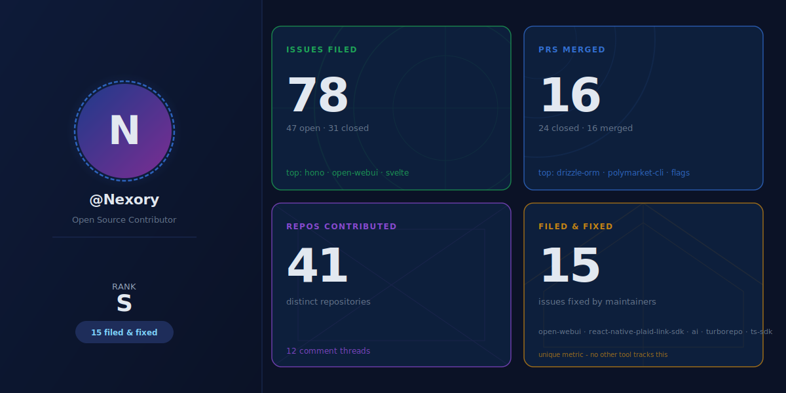

# gh-contrib-stats

Static SVG contribution card for your GitHub profile README, including the unique **filed-and-fixed lineage**: issues you filed that a maintainer later closed with their own merged PR.



## What's different about this card

Most contribution-stats tools count what you authored: PRs merged, issues created, commits. Nobody tracks the *opposite* signal: bugs you found that turned into someone else's merged PR. That's "I filed an issue and a maintainer cared enough to fix it" - a fairly clean indicator of useful upstream contribution, and the data is already in the GitHub timeline API; you just need to walk it.

The card surfaces six numbers:

| Metric | What it means |
|---|---|
| Issues | Issues you filed across all repos (open + closed) |
| PRs Merged | Pull requests you authored that were merged upstream |
| Repos | Distinct repos you contributed to (issues + PRs) |
| Threads | Issues / PRs where you left at least one comment |
| Filed & Fixed | Issues you filed that a third-party PR closed (the lineage metric) |
| Rank | S / A / B / C / D from a weighted score of the above |

## Add it to your own profile in 2 steps

### 1. Create the workflow file

In your **profile repo** (the one named `YOURHANDLE/YOURHANDLE`), create `.github/workflows/update-card.yml`:

```yaml
name: Update contribution card

on:
  schedule:
    - cron: "0 3 * * *"   # 03:00 UTC daily
  workflow_dispatch:

jobs:
  update-card:
    runs-on: ubuntu-latest
    permissions:
      contents: write
    steps:
      - uses: actions/checkout@v4
      - uses: Nexory/gh-contrib-stats@main
        with:
          github_token: ${{ secrets.GITHUB_TOKEN }}
          username: YOURHANDLE
```

### 2. Embed the card in your README

Add this line to your profile `README.md`:

```markdown

```

That's it. The first time the workflow runs (you can trigger it manually under the Actions tab) it commits `card.svg` to the repo, and the README image link starts resolving. After that the daily cron keeps it fresh.

## Run it locally (without the Action)

If you want to generate a one-off SVG without committing anything:

```bash
GITHUB_TOKEN=ghp_xxx npx --yes github:Nexory/gh-contrib-stats --user YOURHANDLE --output card.svg
```

Or clone + build:

```bash
git clone https://github.com/Nexory/gh-contrib-stats
cd gh-contrib-stats
npm install
GITHUB_TOKEN=ghp_xxx npx tsx src/index.ts --user YOURHANDLE --output card.svg
```

A GitHub personal access token lifts the rate limit from 60 to 5000 req/h. The tool works without one for small accounts.

## CLI flags

```
gh-contrib-stats --user <handle> --output <path.svg> [options]

  --user <handle>          GitHub username (required)
  --output <path>          SVG output path (required)
  --theme dark             Theme (only "dark" in v0.1.0)
  --token <tok>            GitHub token (or set $GITHUB_TOKEN)
  --cache-ttl <minutes>    Local cache TTL in minutes (default 360)
  --no-avatar              Skip the avatar fetch; render SVG initials instead
```

## Token scope: what `secrets.GITHUB_TOKEN` can and cannot see

When the action runs in your profile repo it uses `secrets.GITHUB_TOKEN` by default. That token's GitHub search scope matches what an anonymous browser sees: **public repos only**. If you have private repos where you've merged PRs or filed issues, those counts will not appear on the card.

This is intentional behaviour for a public-profile card. The visitor reading your profile can verify every number themselves by running the same search. To include private activity you can pass a personal access token with `repo` + `read:user` scopes via a repo secret:

```yaml
- uses: Nexory/gh-contrib-stats@<sha>
  with:
    github_token: ${{ secrets.CARD_TOKEN }}   # PAT, not GITHUB_TOKEN
    username: YOURHANDLE
```

## Why the avatar can disappear when you open the raw URL directly

`raw.githubusercontent.com` serves `.svg` files with `Content-Security-Policy: default-src 'none'`, which blocks `data:` URIs inside `<image>` elements. That CSP only applies when you open the raw URL directly in a browser. When the same SVG is embedded in a README via GitHub's image proxy (the actual use case for this tool), camo serves it under a permissive CSP and the avatar renders fine.

Quick reference:

| Context | Avatar visible? |
|---|---|
| `https://github.com/USER/USER/blob/main/card.svg` (blob view) | yes |
| `https://raw.githubusercontent.com/USER/USER/main/card.svg` (direct raw) | no (CSP blocks data: URI) |
| `` embedded in any GitHub-rendered Markdown | yes (camo proxy) |
| Saved to disk and opened locally | yes |

If you want the avatar to render in the direct-raw view too, pass `--no-avatar` to fall back to the SVG initials variant (8 KB vs 220 KB and works under any CSP, but no photo).

## How `filed-and-fixed` is computed

For each closed issue authored by the user, walk the issue timeline via `GET /repos/{owner}/{repo}/issues/{number}/timeline`. Look for:

1. A `closed` event whose `commit_id` references a PR not authored by the user, or
2. A `cross-referenced` event whose source is a pull request with `merged: true` and a different author.

Either pattern counts as one filed-and-fixed entry. The closing PR URL + author are stored so future versions of the card can surface them.

Edge cases handled:

- User closes their own issue: not counted (no maintainer contribution).
- Issue closed as `not_planned`: not counted.
- PR not merged at issue-close time: not counted.
- Bot PR authors (`[bot]` suffix): not counted.
- Archived / private repos where the timeline API returns 404: silently skipped.

## Rate limit / refresh cadence

The tool makes roughly 12 GitHub API calls plus 1 per closed issue (up to 200) per refresh, so on the order of 100-220 calls. The action defaults to a 23-hour cache TTL so a single daily run uses well under 1 % of the authenticated rate limit budget. If you'd rather refresh less often, set `cache_ttl_minutes` higher or set the cron to e.g. weekly.

## Tech

- TypeScript 5.4, Node 20
- `@octokit/rest` + `@octokit/graphql` for data
- Pure string templating for SVG (no rendering deps)
- `esbuild` for the CLI bundle

## License

MIT, see LICENSE.
